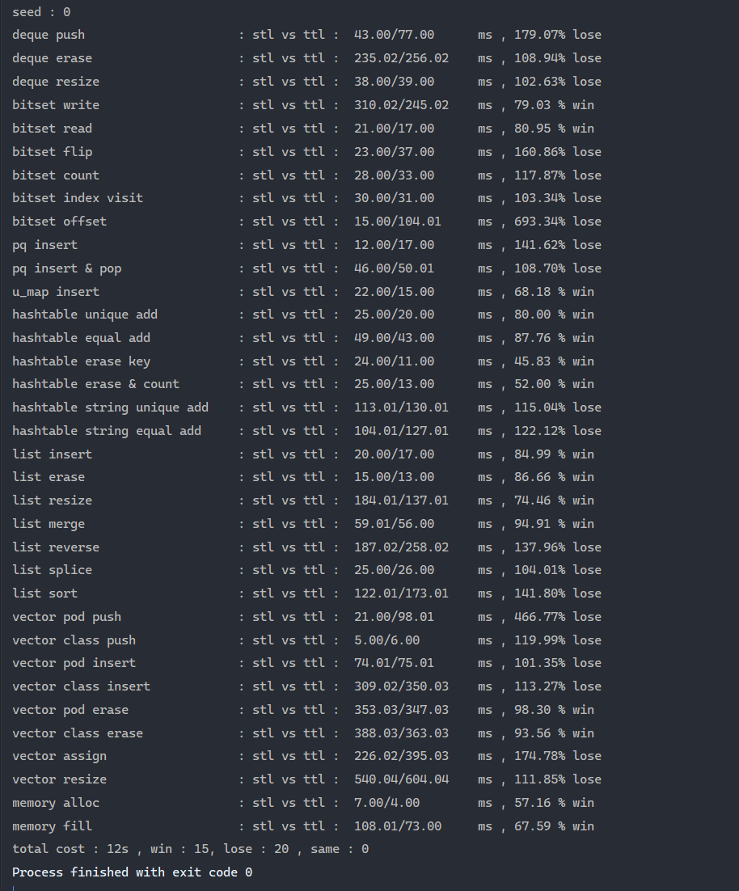

# TinySTL

对STL的部分复现和扩展.

## 目的

- 学习C++新特性
- 学习STL源码
- 学习数据结构的实现原理
- 学习常用算法的实现原理

## 编译环境

- c++17
- mingw gcc 8.1.0
- cmake 3.10.2

## 参考书籍:

- STL源码剖析
- 算法导论

# 项目结构

## 文件速览

```
- src
  - core                  # 项目主体实现
    - adapter             # 适配器容器
      - priority_queue.h  # 优先队列
    - algorithm           # 算法相关
      - algorithm.h
    - allocator           # 分配相关
      - allocator.h     
    - container           # 容器
      - expand            # 扩展容器
        - avl_tree.h      # 平衡二叉搜索树
        - bitset.h        # 位集
      - private           # 某些容器的可复用实现
        - hashtable.h     # 哈希表
      - deque.h           # 双端队列
      - list.h            # 双向链表
      - unordered_map     # 无序单映射
      - vector.h          # 动态数组
    - functor             # 函数相关
      - function.h
    - iterator            # 迭代器相关
      - iterator.h
    - normal              # 基础库相关
      - smart_ptr.h       # 智能指针
      - tuple.h           # 元组
  - tests                 # core中大部分模块的测试代码
    - *_test.h            # *.h的测试代码
  - utils                 # 通用工具
    - profiler.h          # 计时器
    - test_helper.h       # 辅助测试的宏和函数
  - main.cpp              # 调用所有测试用例
```

## 通用工具库

- [ ] pair  
  复现标准库pair
- [ ] string  
  复现标准库string
- [ ] tuple  
  复现标准库tuple
- [ ] qstring  
  复现Qt中QString的大部分功能(如COW)

## 空间配置器

负责内存的配置和管理

- [x] 内存分配器
- [ ] shared_ptr
- [ ] unique_ptr
- [ ] weak_ptr

## 迭代器

作为容器组件和算法组件的粘合剂

- normal_iterator
- reverse_iterator
- 迭代器相关操作函数

## 容器

本项目的核心组件

### 序列容器

- [ ] array  
  静态数组
- [x] vector  
  动态数组
- [x] list  
  双向链表
- [x] deque  
  双端列表
- [ ] stack  
  栈
- [ ] queue  
  队列
- [x] heap  
  序列容器上的一系列操作函数
- [x] priority_queue  
  优先队列
- [ ] forward_list  
  单向链表

### 关联式容器

- [ ] RB-tree  
  红黑树,一系列O(lgn)容器的基础
- [ ] set  
  有序集合
- [ ] map  
  有序映射
- [ ] multiset  
  有序可重复集合
- [ ] multimap  
  有序可重复映射
- [x] hashtable  
  哈希表,一系列O(1)容器的基础
- [ ] unordered_set  
  无序集合
- [x] unordered_map  
  无序映射
- [ ] unordered_multiset  
  无序可重复集合
- [ ] unordered_multimap  
  无序可重复映射

### 扩展数据结构

- [x] bitset  
  定长bitset
- [ ] circular_buffer  
  环形缓冲区
- [ ] bignum  
  高精度浮点数(兼容整数)
- [ ] skip_list  
  跳表
- [ ] trie  
  字典树
- [ ] DAT(Double Array Trie)  
  字典树的压缩结构
- [ ] ac_trie  
  AC自动机(trie+kmp)
- [ ] regex  
  正则表达式(string=>NFA=>DFA)
- [ ] binary_indexed_tree  
  树状数组
- [ ] segment_tree    
  线段树
- [ ] AVL_tree  
  平衡二叉树
- [ ] graph  
  图的一系列抽象
- [ ] matrix  
  矩阵
- [ ] B-tree  
  B树

#### 容易实现的扩展

- [ ] bloom  
  布隆过滤器
- [ ] mono_stack  
  单调栈
- [ ] mono_queue  
  单调队列
- [ ] union-set  
  并查集
- [ ] linked_hashmap  
  list+map实现,用例如LRU容器
- [ ] vbitset  
  变长bitset(包装vector_bool)

## 算法

以迭代器为核心的一系列算法

- 不修改序列的操作
- 修改序列的操作
- 划分操作
- 排序操作
- 二分搜索操作(需要排序)
- 集合操作(需要排序)
- 其他已排序范围上的操作
- 堆操作(见container.heap)
- 最大/最小操作
- 比较操作
- 排列操作
- 二进制位操作

## 仿函数

围绕仿函数的一系列class和func

- function
- bind
- mem_fn
- placeholder
- not_fn
- invoke
- 运算符函数对象
- 引用包装器

## 适配器

### 容器中的适配器模式

- bid container
    - stack
        - mono_stack
    - queue
        - mono_queue
- random container & heap
    - priority_queue
- RB-tree
    - map
    - set
    - multimap
    - multiset
- hashtable
    - unordered_map
    - unordered_set
    - unordered_multimap
    - unordered_multiset

### 核心容器

- vector
- list
- hashtable
- heap
- deque
- RB-tree

# 代码约定

命名空间 :  
主功能 : ttl  
测试代码 : ttl::ttl_test  
命名风格 : 小写_小写

# 测试截图

